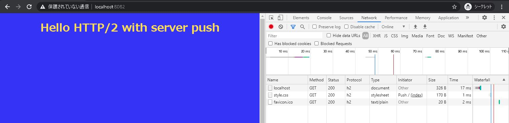

## HTTP/2 server push test

### 概要
HTTP/2 の server push 機能を試す最小サンプル

### 起動方法

```
node server.js
```

### 確認方法

ブラウザで `https://localhost:8082"` を開く。
以下は Chrome のデベロッパーツールで `Push` が行われていることを表示したもの。

`style.css` が server push で受け取られているらしいことが分かる。

